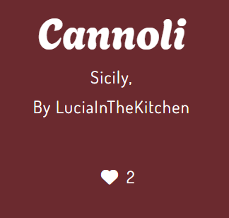

  <h1><strong>Recipe Book App - Don't Break The Spaghetti </strong></h1>

*Your community for learning and sharing traditions of Italian cuisine*  
  
  

[View the live site here](https://dbts-recipe-app-f9995cb6b9df.herokuapp.com/)

Don't Break the Spaghetti is a recipe book of traditional Italian recipes. Users can register for the site in order to post a recipe and like or comment on other recipes. The site is for anyone interested in traditional Italian cuisine and acts as a community allowing users to interact with one another.

## About

This application is **version 2** of the recipe book application. Please view the original project and the design process here: 

  https://github.com/HMuraja/recipe-book-v2

### Problem Statement  

Problem Statement this application solves:

" *I am **a user** trying to **find an application where I can share my interest in traditional Italian cuisine** but **I can't find one** because **most recipe sites are blogs or not specific enough** which makes me feel **like there isn't anyone else interested of this subject*** "

The goals of this application: 
- Build an online recipe book for traditional Italian Recipes.
- Allow users to post and share recipes.
- Any visitor should be able to view recipes.
- Registered users should be able to share recipes with photos and a description.
- Registered users should be able to like and comment on recipes.
- Application should be responsive on different screen sizes.
- The application should provide a simple intuitive interface that is easy to navigate.
- The site's layout and color scheme are pleasing and keep users coming back to it.

### Color Scheme

The color palette for this projects, has been updated. The palette still includes the red, green and yellow colors that are often associated with food but they are less saturated than in version 1. The new more muted palette is less distracting and more fitting for the traditional recipe theme.

View Palette

  

### Database Structure

The same database design from the previsou version was used in version 2.

A design for data was drafted using [diagrams.net](https://app.diagrams.net/).

The data diagram had three models recipe, user and comment. These three tables use foreign keys to connect the data across the tables.

View Diagram

  

## Features

  
Landing Page

  
The home page or landing displays all the shared recipes as recipe cards. The page can display 8 recipes at a time and a "next-button" on the bottom can be used to move between the pages. Each recipe card displays a recipe/placeholder image, the recipe name, region, and city, and a summary of the recipe. Likes are displayed on the upper corner of the recipe cards.

  

  
Header/Navigation Menu

  
The navigation menu and the title are placed on the header of the page and are the same for every page on the site. The navigation menu items are links to the home, login, signup, and logout pages. The logo acts as a link to the home page.

  
  
 Desktop 

    
  
  
  
Mobile

  
Recipe Page

  
On the home page, hovering the mouse over the recipe card will cause a shadow behind the recipe card and a change in the text color.

  
  
Clicking anywhere on the image takes the user to a page with the recipe details. This page can be divided into three sections: recipe header, recipe, and comments.

  

    
View Recipe Page

    
  

  
If the author of the recipe is logged in they can see the buttons to <b>Edit</b> or <b>Delete</b> the recipe.

  

  
Comment

  
If the user wishes to leave a comment, they must log in first and open the recipe they want to add the comment to. On the bottom of the page, there is a 'Leave comment'-form that the logged-in user can submit.

  

  
Like

  
On the recipe page, the user may like the recipe. They must click on the heart icon to like or unlike it. The page will refresh, and the number of likes will be updated.

  

      
      
  

  
Login

  
If the user has already signed up and is logged out, they can press the <i>Log in</i> button on the navigation menu, which opens a login window.

  
  
Once the form is successfully submitted, the user is logged in, and they can view their username on the navigation menu.

  

  
Signup

  
Users can create an account to access features such as commenting, liking, and creating recipes.

  

  
Log out

  
When the user wishes to log out, they must click on the <b>Logout</b> button on the navigation menu.

  

  
Create Recipe

  
Users can create a recipe by clicking the yellow <b>Create Recipe</b> button on the home page or in the navigation menu.

  
  
Once submitted successfully, a confirmation modal appears.

  

  
Edit Recipe

  
Logged-in users can edit their recipes. The author can edit the recipe by clicking the <b>Edit</b> button at the bottom of the recipe page.

  
  
After successful editing, a confirmation message is displayed.

  

  
Admin Comment, User, and Recipe

  
Admins can log in to the admin panel by extending the URL with <code>/admin</code>.

  
  
The login page appears where admins must enter their credentials.

  
  
Once logged in, admins can manage users, comments, and recipes.

  

## Technologies
### Languages
HTML5 - Used on templates to build the structure of the sites and render an interface

CSS3 - Used to add design to the html structure for a more pleasing interface

Python - Used as the backend language.

### Frameworks and Libraries
Versions for all the libraries can be seen in the requirements.txt.

- Django - Used as the full-stack framework to build the website
- Bootstrap- CSS library used to style the html together with custom css.
- psycopg2 - A PostgreSQL database adapter for Python.
- gunicorn - A Python WSGI HTTP Server for UNIX.
- cloudinary - Used to connect Python with Cloudinary storage for all the static files.
- dj-database-url - A Django utility to utilize the DATABASE_URL environment variable to configure the Django application. Used with PostgreSQL.
- dj3-cloudinary-storage - A Django package that facilitates integration with Cloudinary storage.
- django - A Python package for the Django framework.
- django-allauth - An integrated set of Django applications addressing user authentication, registration, and account management.
- django-cleanup - A third-party library for Django that provides automated file cleanup functionality.
- django-crispy-forms - A Django package that provides tags and filters to control the rendering behavior of Django forms.
- django-summernote - A Django package to allow for the embedding of the summer note text editor into Django.
- oauthlib - A generic, spec-compliant, thorough implementation of the OAuth request-signing logic for Python 3.6+.
- PyJWT - A Python library that allows for encoding and decoding of JSON Web Tokens (JWT).
- python3-openid - A set of Python packages to support the use of the OpenID decentralized identity system.
- pytz - A Python package for world timezone definitions, modern and historical.
- requests-oauthlib - A Python package for OAuthlib authentication support for Requests.
- sqlparse - A non-validating SQL parser for Python.
- urllib3 -  Python library that provides HTTP client functionality for making HTTP requests

### Software and Web Applications Used
The following applications were used to make this project:

- App Diagrams - An application used to create database diagrams to visualize the data structure.
- Cloudinary - A cloud-based storage for static files, used to store project images.
- Coolors -  Used to generate the image of the color scheme.
- ~ElephantSQL - A PostgreSQL database hosting service used to store data in this process.~
- SupaBase - hosting service used to store project data.
- FontAwesome - Used to generate icons for the project.
- GitHub - An online repository and version control. Also used as a project management tool.
- GitPod - An online code editor used during this process.
- Google Chrome Dev Tools - A tool provided by Chrome browser, used to troubleshoot and test the responsiveness of the application.
- Google Fonts - A free online library of fonts. Used for applying suitable fonts for the project.
- Heroku - A cloud platform that is used to deploy the applications.
- PowerPoint - Used for creating the site wireframes.

## Deployment
Version 1 was deployed in Heroku, this instance was used to deploy version 2, therefore replacing the previous version. 

### Project Files
1. Since development is complete, set DEBUG = False in your project's settings.py file.
2. Run the collectstatic command using manage.py.
3. Commit all changes to the project files.

### Heroku
1. Open your project > Settings tab
2. Click 'Reveal Config Vars' and ensure the variables are as follows:

    DATABASE_URL = [your database URL goes here]

    SECRET_KEY = [the secret key from that Django generates on the setting.py should be added here and reference to to it added to sertting.py]

    CLOUDINARY_URL = [add cloudinary URL here ]

3. Go to Deploy tab > on App connected to GitHub click Disconnect
4. Connect to the new repository for version 2
5. On Manual Deploy click Deploy Branch
6. Once successfully deployed successfully click on 'Open App' to view your project

## Credits
The following resources were used to help build this project:
- Icons were obtained from [Font Awesome](https://fontawesome.com/)
- Images are from [Pexels](https://www.pexels.com/) 
- [Django Docs](https://docs.djangoproject.com/en/4.2/) were used through out the process to solve issues and used for guidance.
- [Bootsrap Docs](https://getbootstrap.com/docs/5.3/getting-started/introduction/) were used through out the process to solve issues and used for guidance.
- [Summernote Docs](https://summernote.org/deep-dive/) were used throughout the process to solve issues and for guidance.
- [ChatGPT](https://chatgpt.com/) was used to generate recipe descriptions which were amended for accuracy based on the [by the Vagrants of the World blog post](https://vagrantsoftheworld.com/traditional-italian-recipes-by-region/)
